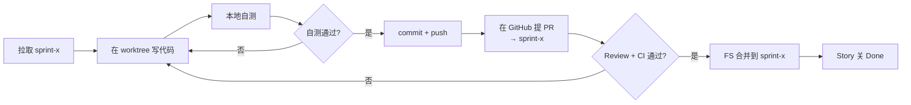

# 团队开发协作 SOP · {{PROJECT_NAME}}

> 面向编码实施团队的"上手即用"操作手册。新成员入组 30 分钟内能开始干活。
> 原理与"为什么"，见 `知识库/Scrum/10_Git仓库布局与提交模式解析.md`。

**项目背景类型：** {{PROJECT_TYPE_LABEL}}
**本 Sprint 仓库策略：** {{REPO_STRATEGY_LABEL}}
**代码位置：** {{REPO_WORKSPACE_LOCATION}}
**适用对象：** PO、SM、TL、Mid.BE、Sr.FE、Mid.FE、FS — 全员

---

## 1. 我是谁、我读什么

| 你是 | 必读 | 直接跳到 |
| --- | --- | --- |
| 编码角色（TL/Mid.BE/Sr.FE/Mid.FE/FS） | 全部 | §3 ~ §8 |
| PO/SM（不直接编码，但要提文档 PR） | §2 §4 §6 §8 | §6 |
| 新加入成员 | §2 §3 §4 §5 | §3 |

---

## 2. 准备工作（一次性）

### 2.1 工具版本

| 工具 | 最低版本 | 验证命令 |
| --- | --- | --- |
| Git | 2.28+（支持 `git init -b` 与 `git worktree`） | `git --version` |
| Node.js | 项目技术栈而定，通常 ≥ 18 | `node -v` |
| 代码编辑器 | 任意，推荐 VS Code | — |

### 2.2 GitHub 账号 & SSH/HTTPS

- 联系 FS 拿到代码仓库地址（HTTPS 或 SSH）
- 让 PO 在 `00_项目导航/03_工具与权限清单.md` 登记你的账号
- 本机 git 全局身份（**仅用于个人辅助仓库**）：
  ```bash
  git config --global user.name  "你的姓名"
  git config --global user.email "你的邮箱"
  ```
- **本项目内**还会单独配 worktree 级身份，见 §4.3

---

## 3. 我属于哪种 Git 仓库模式？

执行：

```bash
cd <项目根目录>
ls -la .git              # 外层是否有 .git
cd <实际代码仓克隆目录>
ls -la .git              # 代码仓是否有 .git
```

对照下表：

| 外层 .git | 内层 .git | 你属于 | 提交去哪 |
| :-: | :-: | --- | --- |
| ✅ | ❌ | **模式 A**：单仓（可选 workspace） | 整个工作区一个仓库，统一提交 |
| ❌ | ✅ | **模式 B**：仅代码仓 | 只提代码仓，文档不进 git（或文档另起 git） |
| ✅ | ✅ | **模式 C**：两仓独立（生产推荐） | 代码进代码仓，文档进文档仓 |
| ❌ | ❌ | 未初始化 | 找 FS 确认初始化策略 |

> 不确定时直接问 FS / SM，**不要凭感觉提交**。

---

## 4. 日常开发循环（编码角色）

### 4.1 一次性：克隆 + 建个人 worktree

{{REPO_SOP_SETUP_NOTE}}

以下命令用于远端重新克隆、中途加入或手工修复。

```bash
# 假设你的显示名是 Evan，槽位是 Mid.FE/QA

# 模式 A：克隆整个工作区
git clone <workspace-repo-url> {{PROJECT_NAME}}
cd {{PROJECT_NAME}}/10_代码仓库/{{REPO_NAME}}

# 模式 B/C：直接克隆代码仓
git clone <code-repo-url> {{REPO_NAME}}
cd {{REPO_NAME}}

# 拉取 Sprint 集成分支（FS 已提前在 GitHub 创建）
git fetch origin sprint-1
git switch sprint-1

# 建个人 worktree（每个 Sprint 一次）
mkdir -p TeamWork
git worktree add TeamWork/Evan_MidFE_QA -b feature/sprint-1/login-flow-evan-mid-fe-qa sprint-1
```

### 4.2 分支命名

```text
feature/sprint-<编号>/<短主题>-<英文名>-<角色代号>
```

示例：
```text
feature/sprint-1/login-flow-evan-mid-fe-qa
feature/sprint-1/api-contract-ritchie-mid-be-qa
feature/sprint-1/ci-baseline-torvalds-fs-devops
```

- 全英文小写 + hyphen `-`
- 短主题 ≤ 3 个单词
- 角色代号见 `00_项目导航/02_角色与联系方式.md`

### 4.3 配置本机 Git 身份（每个 worktree 一次）

> 生成器默认 `repo` 模式下**已自动**为 5 个角色 worktree 调用过 `extensions.worktreeConfig` 与 `--worktree user.name/user.email`。
> 以下命令仅在**手动重建 worktree**、**修正错误身份**、或使用 `--no-worktrees` 后手工创建时才需要。

```bash
git config extensions.worktreeConfig true
git -C TeamWork/Evan_MidFE_QA config --worktree user.name  "Evan"
git -C TeamWork/Evan_MidFE_QA config --worktree user.email "evan@example.com"
```

验证已生成的 worktree 身份：

```bash
git -C TeamWork/Evan_MidFE_QA config --worktree --get user.name
git -C TeamWork/Evan_MidFE_QA log -1 --format='%an <%ae>'
```

> **铁律**：禁止用统一账号代替真实提交身份。每个 commit 必须能追溯到具体人。

### 4.4 日常循环



具体命令：

```bash
cd TeamWork/Evan_MidFE_QA

# 写代码…

# 本地自测（按项目技术栈，举例）
npm test
npm run lint

# 提交
git add .
git commit -m "feat(login): add captcha guard

- 触发条件：连续 3 次失败
- AC: STORY-12 (1/3)
"

# 同步上游（避免落后过多）
git fetch origin sprint-1
git rebase origin/sprint-1     # 或 git merge --ff-only origin/sprint-1

# 推送
git push -u origin feature/sprint-1/login-flow-evan-mid-fe-qa
```

### 4.5 提交信息约定

使用 [Conventional Commits](https://www.conventionalcommits.org/zh-hans/) 简化版：

| 前缀 | 用途 |
| --- | --- |
| `feat:` | 新功能 |
| `fix:` | Bug 修复 |
| `refactor:` | 重构（不改外部行为） |
| `test:` | 仅改测试 |
| `docs:` | 仅改文档 |
| `chore:` | 构建/配置/依赖 |
| `ci:` | CI/CD 改动 |
| `perf:` | 性能优化 |

scope 用模块或子领域，例如 `feat(login): xxx`、`fix(api): xxx`。

### 4.6 PR 必备字段

PR 描述里必须含：

```markdown
## 关联 Story / AC
- Story: STORY-xx
- AC: STORY-xx (1/3, 2/3)

## 改动摘要

## 自测证据
- [ ] 单测通过：`npm test`
- [ ] Lint 通过：`npm run lint`
- [ ] 本地手动验证：<截图或说明>

## FS 集成检查
- [ ] 已与 sprint-x rebase
- [ ] CI 全绿

## 风险与回滚
```

---

## 5. 文档变更怎么提交（PO/SM/全员）

文档变更**不需要** worktree。直接在主工作目录提交：

```bash
# 模式 A：在工作区根直接提交
cd {{PROJECT_NAME}}
# 编辑 01_产品发现/00_产品愿景与目标.md 等
git add 01_产品发现/
git commit -m "docs(product): refine vision statement v2"
git push origin main      # 或文档专用分支
```

文档 PR 一般**不需要** Sprint 集成分支，**直接对 main**。但**重大** AC/Backlog 改动要走 PR + PO Review。

---

## 6. 常见情形 FAQ

### 6.1 我的分支落后 sprint-x 太多

```bash
git fetch origin sprint-1
git rebase origin/sprint-1
# 若冲突，按提示解决
git push --force-with-lease       # 安全 force push，避免覆盖他人
```

> **禁止** `git push --force`，必须用 `--force-with-lease`。

### 6.2 CI 红灯了

| 谁红灯 | 谁修 | 时限 |
| --- | --- | --- |
| 你的 PR | 你自己 | 不限，但不合并 |
| sprint-x 集成分支 | 提交人 + FS | **2 小时内**（红灯过夜=反模式） |
| main | 全员立即响应 | 即时 |

### 6.3 我误提交了 `TeamWork/` 目录

```bash
git rm -r --cached TeamWork/
# 确认 .gitignore 含 TeamWork/
git commit -m "chore: untrack TeamWork local worktrees"
git push
```

### 6.4 我要回滚某次错误合并

**不要** `git reset --hard` push！用 `git revert`：

```bash
git revert <bad-commit-sha>
git push
```

### 6.5 我的 worktree 不要了

```bash
cd <repo-root>
git worktree remove TeamWork/Evan_MidFE_QA
git branch -d feature/sprint-1/login-flow-evan-mid-fe-qa   # 本地分支也清掉
```

### 6.6 我作为新成员中途加入 Sprint

```bash
git clone <code-repo-url>
cd {{REPO_NAME}}
git fetch origin sprint-1
git worktree add TeamWork/<Name>_<Role> -b feature/sprint-1/<topic>-<name>-<role> origin/sprint-1
# 配身份 + 开始写代码
```

让 SM 把你登记到 `00_项目导航/02_角色与联系方式.md` 和 `06_团队输入输出总表/00_索引.md`。

### 6.7 我们项目要从模式 A 切换到模式 C（两仓独立）

由 FS 主导（**风险动作**，要在 Sprint Planning 决议）：

```bash
cd 10_代码仓库/{{REPO_NAME}}

# 1. 在子目录单独 init
git init -b main
git add .
git commit -m "chore: split code repo from workspace"

# 2. 在 GitHub 创建新代码仓
git remote add origin <new-code-repo-url>
git push -u origin main

# 3. 在外层项目工作区 .gitignore 取消注释那一行
#    10_代码仓库/{{REPO_NAME}}/
#    然后 git rm --cached -r 该子目录 + commit

# 4. 通知全员重新克隆代码仓
```

### 6.8 我要在多个分支间快速切换看代码

不要在主目录切，再开一个 worktree：

```bash
git worktree add TeamWork/Evan_Review -d origin/sprint-1
# -d 表示 detached HEAD，只读浏览
# 看完后 git worktree remove
```

### 6.9 我修改了别人的文件，怎么避免冲突

- 提交前**先**说一声（站会或 IM）
- 拉取后再编辑
- 小批量提交 + 频繁 push

### 6.10 我的 commit 邮箱写错了

**已 push 的 commit 不要重写历史**。改本机配置（§4.3）后，新 commit 用对的邮箱。如果有合规审计要求，找 FS 评估是否要 BFG 重写历史。

---

## 7. Done 判定 — Story 关闭前的最小清单

```markdown
- [ ] AC 全部勾选
- [ ] 单测/集成测试通过，CI 绿
- [ ] PR 合并到 sprint-x
- [ ] FS 集成结论：可演示
- [ ] PO 验收通过
- [ ] Story 工作区记录：分支、PR、CI、测试证据、集成结论链接
```

任一项缺失，**不能**关 Done。详见 `知识库/Scrum/08_质量门禁与测试金字塔指南.md`。

---

## 8. 速查卡（贴显示器）

```text
克隆          git clone <url>
拉集成分支    git fetch origin sprint-1 && git switch sprint-1
建 worktree   git worktree add TeamWork/<Name>_<Role> -b feature/sprint-1/<topic>-<name>-<role> sprint-1
配身份        git config extensions.worktreeConfig true；再使用 config --worktree
日常          edit → test → add → commit → fetch → rebase → push
提 PR         GitHub UI，目标 sprint-1
合并          FS 操作，PR Review + CI 绿
回滚          git revert <sha>（禁 reset --hard 后 force push）
清 worktree   git worktree remove <path>
```

---

## 9. 出问题找谁

| 问题 | 找谁 |
| --- | --- |
| 仓库权限 / Git 模式 | FS |
| 分支策略 / 合并冲突 | FS（升级到 TL） |
| Story / AC 不清 | PO |
| 流程阻塞 / 总表不一致 | SM |
| 架构 / 接口契约 | TL |
| 前端体验 / 设计系统 | Sr.FE |
| 测试策略 / 缺陷 | Mid.BE / Mid.FE |

升级路径：直接负责人 → SM → 团队会议。
