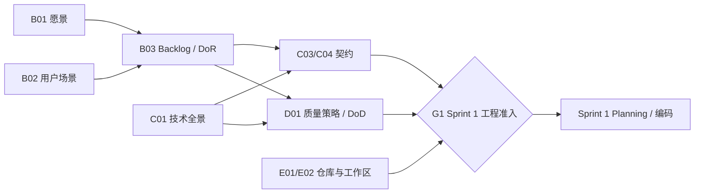

# Sprint 0 · 任务表与流程看板

**Sprint Goal：** 建立团队共同语言、目录体系、首批 Backlog 和工程落地基线。

**快照时间：** {{CREATED_DATE}}

**维护人：** SM 统筹，事实源责任人更新

**当前主阶段：** Sprint 0 / 启动与奠基

**总体健康度：** 🟡 待校准

> 本监控台是本 Sprint 唯一任务执行表和流程视图。Story/优先级看 Backlog，
> 跨 Sprint 的正式产物看输入输出总表，代码证据看 Git/CI；不要另建角色日报。

## 0. Sprint 启动门禁

启动前由四类责任人分别确认，SM 负责组织和播报，不代替专业角色决策：

| 责任人 | 必须确认 | 不负责 |
| --- | --- | --- |
| PO | Sprint Goal、范围、优先级和验收口径 | 不创建代码分支 |
| SM | 会议节奏、任务表、Owner/Reviewer、依赖和启动通知 | 不锁定 Goal，不替 TL 拆技术任务 |
| TL/资深成员 | 模块拆分、复杂度、Reviewer、技术 DoD | 不替 Task Owner 实现 |
| FS | 代码仓、上一关闭基线、Sprint 分支、worktree 和身份 | 不决定产品范围 |

四方确认后由 SM 发布启动通知。发现责任、基线或范围不一致时先登记到 §5，
不得靠群聊中的临时指令覆盖事实源。

## 1. 快照新鲜度

| 事实源 | 最近更新时间 | 责任人 | 新鲜度 | 异常处理 |
| --- | --- | --- | :---: | --- |
| Product Backlog / Story | {{CREATED_DATE}} | PO | 🟡 | 超过 1 个工作日未更新，教练不得推断优先级 |
| 输入输出总表 | {{CREATED_DATE}} | 各产出人 / SM | 🟡 | 产物状态变化后半小时内同步 |
| 风险与障碍 | {{CREATED_DATE}} | 阻塞发现人 / SM | 🟡 | 阻塞超过半天必须登记 |
| Git / PR / CI | {{CREATED_DATE}} | 编码角色 / FS | 🟡 | CI 红灯超过 2 小时升级 |

## 2. 工作流阶段与门禁

团队不必处于单一阶段；以“主阶段 + 工作流阶段”表达并行状态。

| 工作流 | 当前阶段 | 进入条件/必需输入 | 状态 | 缺口或阻塞 | 决策人 | 预计解除 | 依据 |
| --- | --- | --- | :---: | --- | --- | --- | --- |
| 产品流 | 产品发现 | 团队协议、项目类型 | 🟢 | 愿景和用户场景待形成 | PO | 待确认 | B01, B02 |
| Backlog 流 | 准备/Refinement | 愿景、场景、首批 Story | 🔵 | AC、估算、DoR 待补 | PO | 待确认 | B03 |
| 工程流 | 基线设计 | 愿景、现状诊断 | 🔵 | 技术全景、ADR 待评审 | TL | 待确认 | C01, C02 |
| 契约流 | 等待输入 | 候选 Story、技术全景 | ⏸️ | API/数据契约未就绪 | TL | 待确认 | C03, C04 |
| 质量流 | 策略设计 | Story、技术全景 | 🔵 | DoD、测试证据待定义 | QA/TL | 待确认 | D01, D02 |
| 代码协同流 | {{TEAMWORK_FLOW_STAGE}} | 角色、仓库、分支策略 | {{TEAMWORK_FLOW_STATE}} | {{TEAMWORK_FLOW_GAP}} | FS | 待确认 | E01, E02 |
| 发布流 | 暂未开放 | 架构、质量基线 | ⚪ | 等待 C01、D01 | FS | 待确认 | E03 |

状态：`⚪ 未开放` · `🔵 未开始` · `🟢 进行中` · `⏸️ 等待输入` · `🔴 阻塞` · `✅ 已完成/门禁通过`

健康度：`🟢` 无超阈值风险 · `🟡` 有等待/陈旧信息但 Sprint Goal 尚可达 ·
`🔴` Sprint Goal、生产稳定性或关键门禁已受威胁。

## 3. 依赖时间线与并行泳道

关系类型：

- **硬依赖**：前项未完成，后项不能开始。
- **软依赖**：可以先形成草稿，但定版必须等待。
- **独立并行**：不依赖其他进行中活动，可以同时推进。
- **反馈依赖**：评审结果可能让前项返回修订。
- **决策门禁**：必须由 PO、TL 或 FS 作出授权或取舍。

| 时序层 | 活动 | 主责 | 前置输入 | 关系 | 可并行活动 | 完成后解锁 | 状态 |
| --- | --- | --- | --- | --- | --- | --- | :---: |
| L0 现在 | B01 愿景、B02 用户场景 | PO | 团队协议、项目类型 | 独立并行 | C01、E01/E02 | B03 | 🔵 |
| L0 现在 | C01 技术全景 | TL | 现状诊断、初步愿景 | 软依赖 | B01/B02、E01/E02 | C03、C04、D01 | 🔵 |
| L0 现在 | E01/E02 仓库与角色工作区 | FS | 角色和仓库策略 | 独立并行 | B01/B02、C01 | G1 工程准入 | {{TEAMWORK_FLOW_STATE}} |
| L1 随后 | B03 首批 Backlog 达到 DoR | PO / 全员 | B01、B02 | 硬依赖 | C01 | C03、D01、Sprint 1 候选 | 🔵 |
| L1 随后 | C03 API、C04 数据契约 | TL / BE / FE | B03、C01 | 硬依赖 | D01、设计准备 | 编码并行、测试设计 | ⏸️ |
| L1 随后 | D01 质量策略与 DoD | QA / TL | B03、C01 | 软依赖 | C03/C04 | G1 工程准入 | 🔵 |
| G1 汇合门 | Sprint 1 工程准入 | PO / TL / FS | B03、C03、C04、D01、E02 | 决策门禁 | - | Sprint 1 Planning / 编码 | ⚪ |

时间线表达因果顺序，不是把并行 Scrum 变成瀑布计划。SM 只维护影响
Sprint Goal 的关键依赖；具体执行状态以下方任务表为准。

## 4. Sprint 任务执行表

{{TASK_EXECUTION_TABLE}}

> PO/TL/资深成员负责目标、模块边界、任务拆分、复杂度和 Review；执行成员
> 默认只更新“状态、输出/证据、更新时间”，不为普通实现任务另写报告。

任务级别：

- `D/A` 决策或架构：由 PO、TL、资深角色承担，必要时输出精简文档。
- `I/V` 实现或验证：以代码、测试和任务状态为主，默认不新建说明文档。
- `O` 工程环境：能本地实现时先完成；外部环境不可用则提交操作说明并标记待验证。
- 复杂度 `L` 由资深成员承担或结对；`S/M` 优先交给中初级成员。
- 单任务目标在 0.5-2 天完成；更大任务由拆分人继续拆解。

## 5. 例外与裁决（仅异常时填写）

正常事实只写任务行、PR/MR、CI 或 Review；启动、首次开工、合并、关闭四个门禁
全部通过时不新增记录。偏离计划、职责、证据契约或目标时才新增一行。

| ID | 类型 | 事实与证据 | 影响 | 决策人 | 裁决/后续动作 | 状态 |
| --- | --- | --- | --- | --- | --- | --- |

状态只用：`open`、`accepted`、`closed`、`carry-over`。`open` 不得关闭 Sprint；
`carry-over` 必须有 Owner、目标时机和可验证结果。

## 6. 流程预警

| 信号 | 阈值 | 当前状态 | 负责人 | 教练动作 |
| --- | --- | :---: | --- | --- |
| 事实源陈旧 | 超过 1 个工作日 | ⚪ | 对应责任人 | 要求更新；更新前不推断 |
| 未登记阻塞 | 超过半天 | ⚪ | 阻塞发现人 / SM | 登记并明确清障人 |
| 单人 WIP | 超过 2 项 | ⚪ | 成员 / SM | 停止拉新，先完成或协作 |
| CI 红灯 | 超过 2 小时 | ⚪ | 提交人 / FS | 升级 Sprint 风险 |
| 待 PO 验收 | 超过 2 天 | ⚪ | PO | 提醒验收或重新拆分 |
| 决策门禁缺失 | 开工前发现 | ⚪ | PO/TL/FS | 暂停不可逆实现 |
| 外部环境待验证 | 已有可执行说明和验证人 | ⚪ | FS / 指定验证人 | 标记待验证，不作为开发阻塞 |

## 7. 教练查询回复

成员状态变化时主动发送状态包，SM 回复“已同步”或“待澄清”；群聊快报、
流程全景、单角色状态卡和状态纠偏统一使用
`00_项目导航/09_SM教练查询与回复模板.md`。信息陈旧或冲突时，教练必须
回答“当前状态无法可靠判断”，不得自行猜测或替 PO/TL 派活。

## 8. 每日同步

- [ ] 成员只更新发生变化的任务行；无变化不填日报、不重复汇报。
- [ ] 站会后登记新障碍、清障人和预计解除时间。
- [ ] 状态只引用事实源 ID/链接，不复制完整 Story 或产物内容。
- [ ] Sprint 范围变化由 PO 决策；技术门禁由 TL 决策；集成和发布门禁由 FS 协调。
**铁律：Sprint 结束后归档本监控台，不回写历史快照。**
