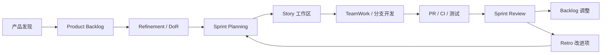

# Scrum 团队协同知识总纲

## 1. 这套知识库解决什么问题

这套知识库来自 QFD_Ark 的 Scrum 落地实践，目标不是复述教科书，而是把团队真正踩过的坑、形成的规则和可复用的工作方法传承下来。

它解决五个问题：

| 问题 | 回答 |
| --- | --- |
| 团队为什么要用 Scrum | 用短周期增量把复杂产品风险显性化 |
| Scrum 不是会议模板，那是什么 | 是围绕价值、证据和反馈形成的工作系统 |
| 小团队多人多帽子怎么协作 | 角色帽子清晰，能力备份显性，隐形工作进 Backlog |
| 文档和代码如何不打架 | 项目工作区是文档事实源，代码仓库放可执行资产 |
| 经验如何传承 | 当期执行在工作区，稳定经验进知识库 |

## 2. 最小原则

1. 先判断项目类型，再选择 Sprint 0 策略。
2. 先建立输入输出规范，再要求团队产出。
3. 总表不是报表，是团队协作雷达。
4. Done 必须有证据链：AC、PR、CI/验证、测试、验收、集成结论。
5. 代码仓库不是文档仓库，文档主事实源在项目工作区。
6. TeamWork 是本地协同机制，不是交付物。
7. Retro 每次只沉淀 1-3 个可执行改进项。
8. 知识库沉淀稳定经验，不承接当期执行碎片。
9. Sprint时间盒关闭、目标达成、治理闭环和下一轮准入分别判定。

## 3. Scrum 在本模板中的工作流

## 4. 目录与知识关系

| 层级 | 位置 | 作用 |
| --- | --- | --- |
| 项目执行层 | `00_项目导航/` 到 `07_度量改进/` | 当期项目事实源 |
| 代码实施层 | `10_代码仓库/<RepoName>/` | 可执行代码、脚本、CI、迁移、测试 |
| 会议决策层 | `90_会议与决策/` | 跨角色决策记录 |
| 知识沉淀层 | `知识库/` | 稳定方法论、经验教训、模板演进 |

## 5. 从哪里开始读

- 新成员：先读 `00_Scrum团队协同知识总纲.md` 和 `02_角色协同与能力模型.md`。
- SM：重点读 `03_落地执行与SM作战指南.md` 和 `12_SM流程监控与角色行动决策规范.md`。
- Sprint收尾责任人：重点读`14_Sprint关闭与证据治理规范.md`。
- TL/FS：重点读 `05_工程实施与TeamWork协同规范.md`、`10_Git仓库布局与提交模式解析.md` 和 `11_角色工作区与Git身份引导规范.md`。
- PO：重点读 `01_敏捷流程与工件指南.md` 和 `04_Sprint0与项目类型指南.md`。
- 模板维护者：重点读 `06_经验教训与反模式清单.md` 和项目模板目录。
